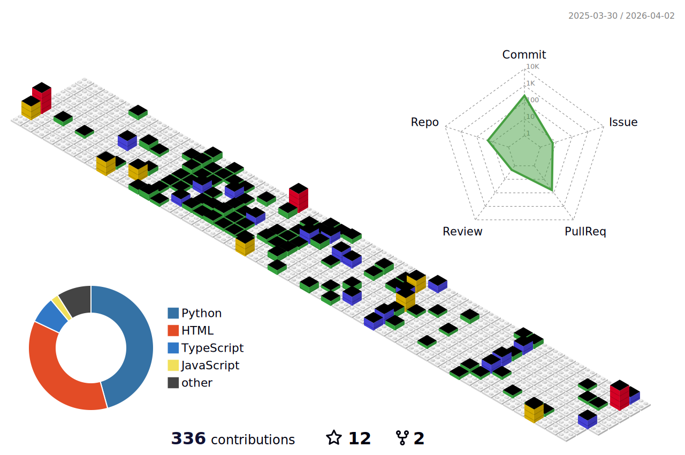

  <!-- knock code pictures 敲代码的图片 -->
  <picture>
    <source media="(prefers-color-scheme: dark)" srcset="./assets/images/coding.gif" />
    <source media="(prefers-color-scheme: light)" srcset="./assets/images/developer.svg" height="225px" />
    
  </picture>

<h2>🙋 Hello, I am Yifei Zhang, you can learn more about me from <a href="https://hoder-zyf.github.io/" target="_blank">my personal webiste</a>.</h2>

  <!-- Snake Code Contribution Map 贪吃蛇代码贡献图 -->
  <picture>
    <source media="(prefers-color-scheme: dark)" srcset="./profile-snake-contrib/github-contribution-grid-snake-dark.svg" />
    <source media="(prefers-color-scheme: light)" srcset="./profile-snake-contrib/github-contribution-grid-snake.svg" />
    
  </picture>

<!-- ########################################## 分割 ########################################## -->

<!-- metrics 基础资料 -->

<!-- ########################################## 分割 ########################################## -->

<!-- profile-3d-contrib 3D 贡献图-->
<picture>
  
</picture>

<!-- ########################################## 分割 ########################################## -->

<!-- GitHub metrics 信息指标 -->

<!-- second form 第一个表格 -->
<table>
  <tr>
    <td></td>
    <td></td>
     <td></td>
    </tr>
</table>

<!-- ########################################## 分割 ########################################## -->

<!-- just img 图片 -->

